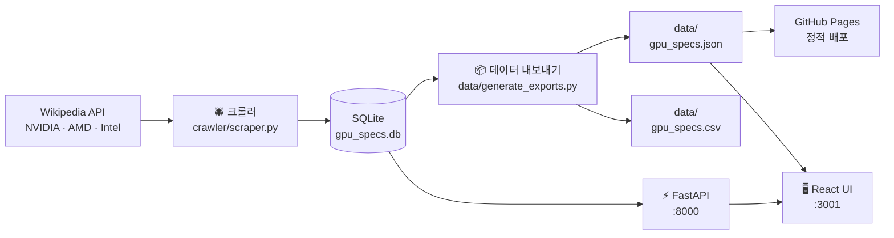

# GPU Specs KR

**Wikipedia의 NVIDIA·AMD·Intel GPU 스펙을 수집해 검색 가능한 JSON·CSV·SQLite·REST API로 제공하는 오픈소스 프로젝트**

Open-source NVIDIA, AMD and Intel GPU specifications dataset, REST API and Korean web UI — powered by Wikipedia.

[웹에서 검색하기 (로컬)](#빠른-시작) | [JSON 다운로드](data/gpu_specs.json) | [CSV 다운로드](data/gpu_specs.csv) | [API 문서 (로컬)](http://localhost:8000/docs)

## 아키텍처



## 현재 데이터

- 총 GPU: 1,833개
- NVIDIA: 959개
- AMD: 870개
- Intel: 4개
- 마지막 갱신: 2026-07-20

## 주요 기능

- GPU 이름·칩셋 검색
- 제조사·VRAM·출시 연도 필터
- GPU 최대 3개 비교
- JSON·CSV·SQLite 데이터셋 제공
- FastAPI REST API (`/docs` 에서 자동 문서 확인)
- Wikipedia 원문 출처 연결
- 정규화된 숫자 필드 (`memory_size_gb`, `tdp_w`, `release_year`)
- GitHub Actions 기반 주간 자동 갱신

## 데이터 구조

`data/schema.json` 에 전체 필드 목록과 한국어·영문 설명이 포함되어 있습니다. 주요 필드:

| 필드 | 타입 | 한국어 설명 |
|------|------|-------------|
| `name` | TEXT | GPU 모델명 |
| `manufacturer` | TEXT | 제조사 (NVIDIA / AMD / Intel) |
| `architecture` | TEXT | 아키텍처 / 세대 |
| `gpu_chip` | TEXT | GPU 칩 코드네임 |
| `release_date` | TEXT | 출시일 (원문) |
| `release_year` | INTEGER | 출시 연도 (파싱된 정수) |
| `memory_size` | TEXT | 메모리 용량 (원문) |
| `memory_size_gb` | REAL | 메모리 용량 GB (파싱된 실수) |
| `tdp` | TEXT | TDP (원문) |
| `tdp_w` | INTEGER | TDP 와트 (파싱된 정수) |
| `source_page` | TEXT | 출처 Wikipedia 페이지 제목 |
| `collected_at` | TEXT | 수집 시각 (UTC ISO 8601) |
| `last_updated_at` | TEXT | 마지막 갱신 시각 (UTC ISO 8601) |

전체 스키마: [`data/schema.json`](data/schema.json)

## 빠른 시작

### 데이터만 사용

```bash
# JSON 직접 다운로드
curl -O https://raw.githubusercontent.com/jaeseok614/gpu-specs-kr/main/data/gpu_specs.json

# CSV 직접 다운로드
curl -O https://raw.githubusercontent.com/jaeseok614/gpu-specs-kr/main/data/gpu_specs.csv
```

### 로컬 전체 실행

#### 1단계: 크롤러 실행 (데이터 수집)

```bash
cd crawler
python -m venv venv && source venv/bin/activate  # Windows: venv\Scripts\activate
pip install -r requirements.txt

# 전체 크롤링 (약 1,800개 GPU)
python scraper.py

# 테스트용 소량 크롤링
python scraper.py --limit 50

# 요청 간격 조절 (기본 1.0초)
python scraper.py --delay 2.0
```

데이터는 `backend/gpu_specs.db` 에 저장됩니다.

#### 2단계: 데이터 내보내기 (선택)

```bash
python data/generate_exports.py
# → data/gpu_specs.json, data/gpu_specs.csv, data/schema.json 생성
```

#### 3단계: 백엔드 실행

```bash
cd backend
python -m venv venv && source venv/bin/activate
pip install -r requirements.txt

python main.py
# 또는
uvicorn main:app --reload --host 0.0.0.0 --port 8000
```

API 문서: [http://localhost:8000/docs](http://localhost:8000/docs)

#### 4단계: 프론트엔드 실행

```bash
cd frontend
npm install
npm start
```

UI: [http://localhost:3001](http://localhost:3001)

## API 엔드포인트

| 메서드 | 경로 | 설명 |
|--------|------|------|
| GET | `/health` | 서버 상태 확인 |
| GET | `/gpus` | GPU 목록 (검색, 필터, 페이지네이션) |
| GET | `/gpus/{id}` | GPU 상세 정보 |
| GET | `/gpus/compare?ids=1,2,3` | GPU 비교 (최대 3개) |
| GET | `/gpus/manufacturers` | 제조사 목록 |
| GET | `/gpus/stats` | 전체 통계 |

### 검색/필터 파라미터 (`GET /gpus`)

| 파라미터 | 타입 | 설명 |
|----------|------|------|
| `search` | string | GPU 이름, 칩셋으로 검색 |
| `manufacturer` | string | 제조사 필터 |
| `min_memory` | float | 최소 VRAM (GB) |
| `max_memory` | float | 최대 VRAM (GB) |
| `min_year` | int | 최소 출시 연도 |
| `max_year` | int | 최대 출시 연도 |
| `page` | int | 페이지 번호 (기본: 1) |
| `limit` | int | 페이지당 항목 수 (기본: 20, 최대: 100) |

## 프로젝트 구조

```
gpu-specs-kr/
├── crawler/
│   ├── scraper.py          # Wikipedia 크롤러
│   └── requirements.txt
├── backend/
│   ├── main.py             # FastAPI 앱 진입점
│   ├── database.py         # SQLAlchemy 설정
│   ├── models.py           # ORM 모델
│   ├── schemas.py          # Pydantic 스키마
│   ├── requirements.txt
│   └── routers/
│       └── gpu.py          # GPU API 라우터
├── data/
│   ├── generate_exports.py # JSON·CSV·스키마 내보내기 스크립트
│   ├── gpu_specs.json      # GPU 전체 데이터 (JSON)
│   ├── gpu_specs.csv       # GPU 전체 데이터 (CSV)
│   └── schema.json         # 필드 정의 (한국어·영문)
├── frontend/
│   ├── package.json
│   └── src/
│       ├── App.js
│       ├── api.js
│       ├── components/
│       └── pages/
└── .github/
    └── workflows/
        └── update-data.yml # 주간 자동 갱신 워크플로
```

## 자동 갱신

`.github/workflows/update-data.yml` 에 정의된 GitHub Actions 워크플로가 **매주 일요일 02:00 UTC** 에 자동으로 실행됩니다.

1. Wikipedia 크롤러 실행
2. JSON·CSV 내보내기
3. `data/` 폴더 커밋 및 푸시

`workflow_dispatch` 로 수동 실행도 가능합니다.

## 데이터 출처

Wikipedia (NVIDIA GPU list, AMD GPU list, Intel Arc) — [CC BY-SA 4.0](https://creativecommons.org/licenses/by-sa/4.0/)

데이터 원문 출처:
- [List of Nvidia graphics processing units](https://en.wikipedia.org/wiki/List_of_Nvidia_graphics_processing_units)
- [List of AMD graphics processing units](https://en.wikipedia.org/wiki/List_of_AMD_graphics_processing_units)
- [Intel Arc](https://en.wikipedia.org/wiki/Intel_Arc)

## 활용 프로젝트

### [LLM GPU Checker KO](https://github.com/jaeseok614/llm-gpu-checker-ko)

> 내 GPU에서 어떤 LLM을 현실적으로 실행할 수 있는지 확인하는 한국어 웹 도구

GPU 스펙 데이터는 **gpu-specs-kr** 프로젝트를 기반으로 관리합니다.

| 프로젝트 | 역할 |
|----------|------|
| **gpu-specs-kr** (이 저장소) | GPU 원천 데이터 · 정규화 · API |
| [llm-gpu-checker-ko](https://github.com/jaeseok614/llm-gpu-checker-ko) | 위 데이터를 활용하는 LLM 호환성 계산기 |

[웹에서 바로 사용하기 →](https://jaeseok614.github.io/llm-gpu-checker-ko/)

## 기여

이슈·PR 모두 환영합니다. 데이터 품질 개선, 새 필드 추가, UI 개선 등 어떤 기여도 좋습니다.
